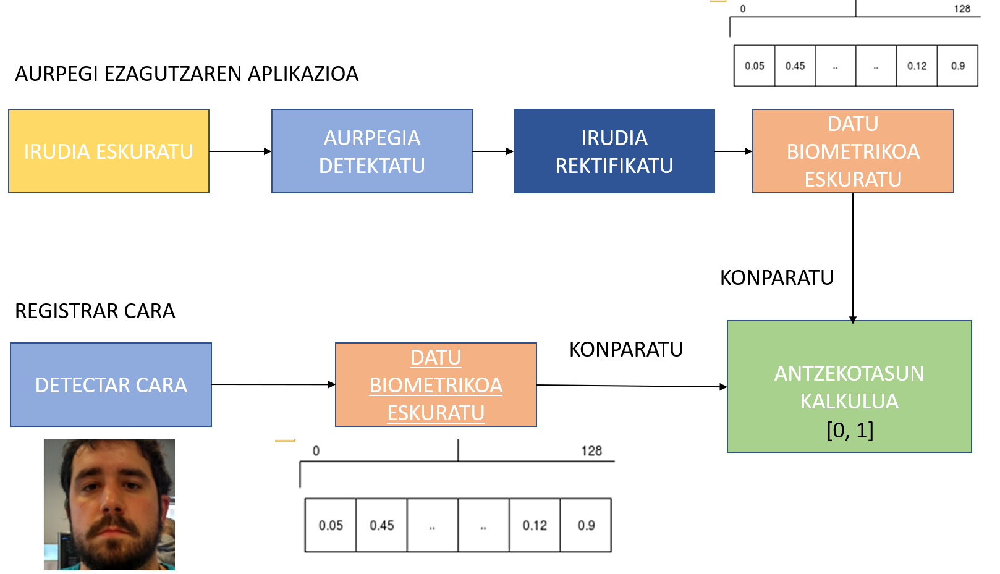
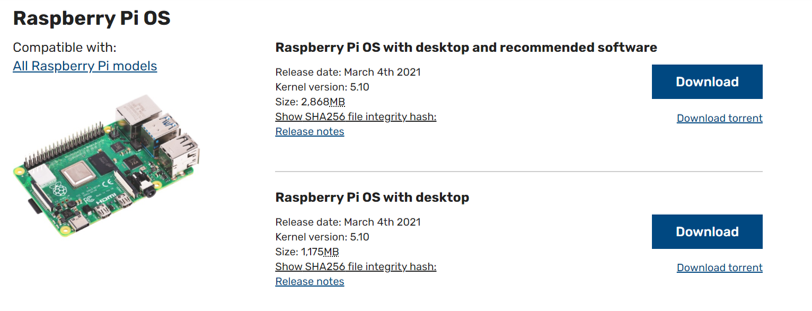

# Montatu zure aurpegi ezagutzaren sistema 80 euro baino gutxiagoren truke.
Kode errepositorio hau Araba Encounter 08an emandako tailerrari dagokio.

## Zer hardware behar dugu  aurpegi ezagutzaren sistema instalatzeko?
- Raspberry Pi 3 model b+ (ordenagailu eramangarri bat ere erabil daiteke)
- Kamera bat (USB bidez doan edozein webcam).

## Nola funtzionatzen du aurpegi-ezagutzak?
Aurpegiaren ezagutzak, bere oinarrian, bektore biometrikoak konparatzean du helburu.
Horretarako, 2 irudi behar ditugu, Erregistratua (erregistratutako bektore biometrikoa) eta ezagutu beharreko irudia.



- **Aurpegiak detektatzea:** aurpegiaren posizioa espazioan (X,Y) bilatzean datza,
 webcameko irudia kontutan hartuta.
 
- **Bektore biometrikoa kodifikatzea:** aurpegia kodifikatzeko 128 laukiko bektore bat sortzen da.

## Nola hasi?
## Software dependentizak instalatzen:
- Ordenagailu bat baduzu, requirements.txt fitxategian dauden dependentziak erabil ditzakezu.
- Raspberry PI-a erabiliz gero, lehenik eta behin Raspbian so-ren irudia muntatu behar da SD aren barruan.

Raspbian sistema operagailuaren irudia hurrengo estekatik jaitsi behar da.
https://www.raspberrypi.org/software/operating-systems /

Aukeratu sistema eragile osoa (dena barne duena.)

Irudia muntatzeko, adibidez:


Lehenik eta behin, jarri irudia SD-n Raspberry Pi-rako.

Irudiak muntatzeko programa ugari daude Raspberry Pi-an

Honako hau erabil dezakezue adibidez:

[balena_ektcher](https://www.balena.io/etcher/)

## Kodea errepositoriok lortzen
horretarako git clone bat egin behar da. 
```python 
git clone https://github.com/uelordi01/ae08facerec.git
```

## Dependentziak instalatzea:
Ordenagailurako:

```python 
pip3 Install -r requirements.txt
```
Raspberry Pi-rako:

```Python
./install_on_raspi.sh
```

## webcametik irudiak hartzea
Adibidea camera_capture.py-an agertzen da.

```Python
Python3 camera_cape.py
```

Kodea:

```Python
import cv2
import numpy as np

video_capture = cv2.VideoCapture(0) # kamara hautatu
capture = False
while True:
    ret, frame = video_capture.read() # irudia lortu
    cv2.imshow("current_frame",frame) # irudia lehio batera proiektatu
    if cv2.waitKey(1) & 0xFF == ord('q'):
        break
video_capture.release()
cv2.destroyAllWindows()
```

## Aurpegia detektatzea
```python
import face_recognition
import cv2
video_capture = cv2.VideoCapture(0)
capture = False
while True:
    ret, frame = video_capture.read()
    face_locations = face_recognition.face_locations(frame, model="hog") # laukizuzenaren posizio eta neurriak (luzera, zabalera) hartzen ditu. 
    if face_locations:
        cv2.rectangle(frame, (face_locations[0][3], face_locations[0][0]),
                              (face_locations[0][1], face_locations[0][2]),
                               (255,0,0), 2)
    cv2.imshow("face_detection",frame)
    key = cv2.waitKey(1)
    if key == 27:
        break
# Release handle to the webcam
video_capture.release()
```

### Erabiltzailea erregistratzea edo bektore biometrikoa sortzea:
Hau da adimen artifiziala aplikatzen den zatia, sare neuronal bat erabiltzen da. 
FaceNet sarea hain zuzen. 

! [Bektore biometrikoa sortzea] (img/ivector.png "aurpegi-ezagutzaren prozesua")
** getIVectorsFromCam.py** ren scriptak detektatutako aurpegiaren bektore biometrikoa itzultzen du.
Funtzio gakoa honako hau da:
```python
Face_locations = face_recognition.face_locations (frame) #aurpegiaren kokapena lortzen dugu
Face_encodings = face_recognition.face_encodings (frame, face_locations) #bektore biometrikoa lortzen dugu.
```
**scriptak erregistrer_user.py**, pertsonaren aurpegia erregistratzen du (irudia bakarrik gordetzen da), db karpetan.
## Aurpegi ezagutzaren demoa:
**facerec_demo.py** ren scriptak egiten du aurpegi-ezagutzaren konparazioa.

```Python
Face_distances = face_recognition.face_distance (known_face_encodings, face_encoding)
```

- known_face_encodings: erregistratutako bektore biometrikoak.
- face_encoding: momentuan jasotako iruditik aurpegiaren bektore biometrikoa.

0 eta 1 arteko balioa jasoko dugu erregistratutako bektoreen array batean.

## kontaktua: 
Jarri issueak beldurrik gabe.
