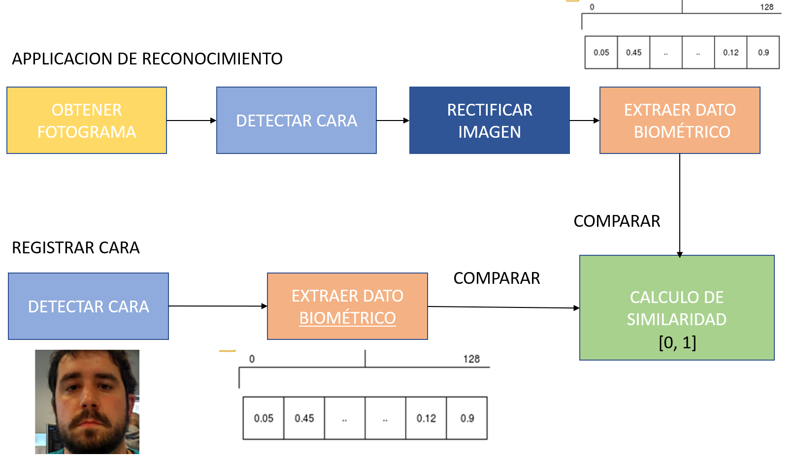
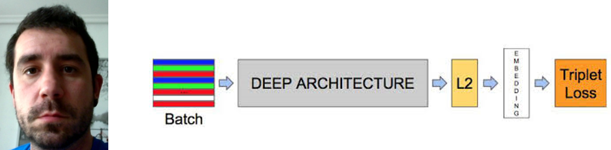

# Aprende a montar tu propio sistema de reconocimiento facial por menos de 80 euros. 
Este repositorio se refiere al taller impartido en la Araba Encounter 08. 

## ¿Qué hardware necesitamos para desplegar el sistema de Reconocimiento Facial?
- Raspberry PI 3 model b+ (tambien se puede usar un portatil)
- una cámara (cualquier webcam que vaya por usb).

## ¿Cómo funciona el reconocimiento facial?
El reconocimiento facial basicamente consiste en extraer los vectores biometricos 
de las caras y compararlas entre sí. Para ello, necesitamos 2 imágenes, la imagen
registrada (vector biométrico registrado) y la imagen a reconocer. 



Detectar caras: consiste en detectar la posición (X,Y) en la imagen de la cara. 
Extraer Vector Biometrico: consiste en generar un vector de 128 casillas para codificar la cara.

## ¿Como empezar?
### Instalando dependencias: 
- Si tienes un ordenador puedes usar las dependencias que están puestas en el requirements.txt
en el repositorio.
- En el caso de usar la raspberry pi, primero hay que montar la imagen de Raspbian SO en la SD.

Es necesario bajarse la imagen de Raspbian SO del siguiente enlace. 
https://www.raspberrypi.org/software/operating-systems/

Elegid el sistema operativo completo

Para montar la imagen podeis usar  por ejemplo: 

 
Instalar imagen en la SD para la Raspberry PI

Hay mucha variedad de programas para montar imagenes en Raspberry PI

podeis usar la siguiente: 
[Ballena ektcher](https://www.balena.io/etcher/)

### Obtener repositorios: 
Hacer un clone del repositorio:  
```python
git clone https://github.com/uelordi01/ae08facerec.git
```

### Instalar dependencias: 
para ordenador:
```python 
pip3 install -r requirements.txt
```
Para raspberry PI:
```python 
 ./install_on_raspi.sh
```

### Captura de video
El ejemplo está en camera_capture.py
```python
python3 camera_capture.py
```
Código: 
```python
import cv2
import numpy as np

video_capture = cv2.VideoCapture(0) # elegir camara
capture = False
while True:
    ret, frame = video_capture.read() # obtener fotograma
    cv2.imshow("current_frame",frame) # visualizar imagen.
    if cv2.waitKey(1) & 0xFF == ord('q'):
        break
video_capture.release()
cv2.destroyAllWindows()
```

### Detección de cara
El ejemplo está en face_detection.py
```python
import face_recognition
import cv2
video_capture = cv2.VideoCapture(0)
capture = False
while True:
    ret, frame = video_capture.read()
    face_locations = face_recognition.face_locations(frame, model="hog") #nos devuelve la posición del recuadro y sus dimensiones
    if face_locations:
        cv2.rectangle(frame, (face_locations[0][3], face_locations[0][0]),
                              (face_locations[0][1], face_locations[0][2]),
                               (255,0,0), 2)
    cv2.imshow("face_detection",frame)
    key = cv2.waitKey(1)
    if key == 27:
        break
# Release handle to the webcam
video_capture.release()
```

### Registrar usuario o generación de vector biometrico: 
Esta es la parte donde se aplica la inteligencia artificial

el script de **getIVectorsFromCam.py** devuelve el vector biométrico del la cara detectada. 
La función clave es: 
```python
face_locations = face_recognition.face_locations(frame) #obtenemos localización cara
face_encodings = face_recognition.face_encodings(frame, face_locations) #conseguimos el vector biométrico. 
```
el script **register_user.py**, registra la cara de la persona, en la carpeta db.
### reconocimiento facial: 
el script de **facerec_demo.py** es el que hace el reconocimiento facial. 
```python
 face_distances = face_recognition
                .face_distance(known_face_encodings, face_encoding)
``` 
- known_face_encodings: vectores biometricos registrados. 
- face_encoding: el vecto biometrico de la cara actual. 

recibiremos un valor entre 0 y 1 en un array de los vectores registrados. 

